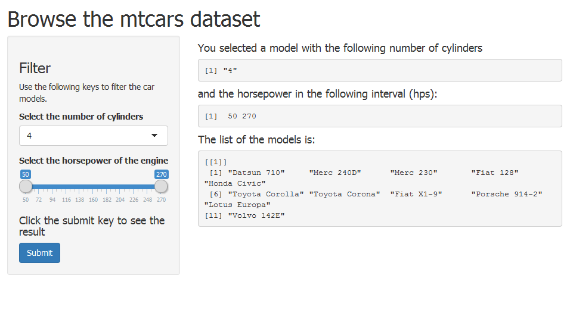

Developing Data Products: Course Project
========================================================
author: Amin
date: 21-Nov-2015
transition: rotate

Summary
========================================================

This a project for the Developing Data Products course from the 
Coursera Data Science Specialization of the Coursera. This is simple
shiny app to browse the data of the classic mtCars data set. 

Data 
========================================================

The data 
contains the information of the car models from 1973-1974. The app lets 
to choose the car models based on the number of cylinders and the
horsepower. I used this code to load the data.


```r
library(datasets)
data(mtcars)
head(mtcars[,c(1:6)],4)
```

```
                mpg cyl disp  hp drat    wt
Mazda RX4      21.0   6  160 110 3.90 2.620
Mazda RX4 Wag  21.0   6  160 110 3.90 2.875
Datsun 710     22.8   4  108  93 3.85 2.320
Hornet 4 Drive 21.4   6  258 110 3.08 3.215
```

Application
========================================================

There are two parameters to select the subsets of the cars: number of cylinders
(cyl) and horsepower engine power (hp). 



Result
========================================================

By clicking on the submitt button, the app browses the data, and 
returns a list of models that satisfy the chosen criteria. 

